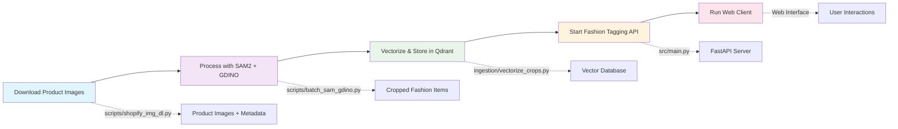
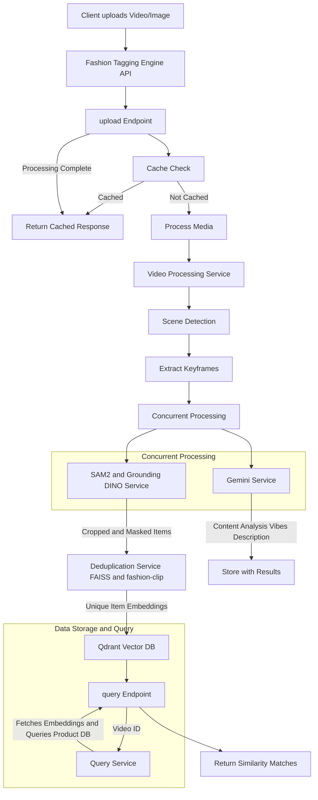
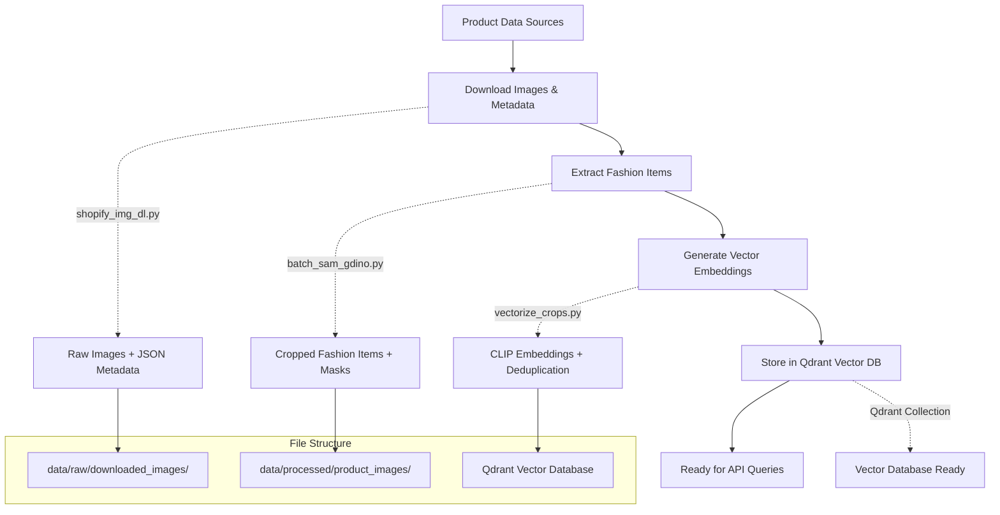

# Fashion Item Tagging Engine Documentation

## 1. Introduction

**🎥 Watch the system overview:** [Fashion Item Tagging Engine Demo](https://www.loom.com/share/5b447e689c724fa0ab940b907a22ef33?sid=9ced9bab-08bb-4acb-826b-0bccb568fe0a)

The engine is designed to analyze video and image content, identify fashion items, and find similar products from a catalog.

### Core Functionalities

* **Media Processing**: Accepts video (MP4) and image (JPG, PNG, JPEG) uploads.
* **Object Detection & Tagging**: Identifies fashion-related items using Grounding DINO.
* **Image Segmentation**: Creates precise cutouts using SAM2 (Segment Anything Model 2).
* **Content Analysis**: Utilizes Google's Gemini for transcription, descriptions, and vibe analysis.
* **Deduplication**: Uses FAISS to remove visually similar items.
* **Vector Search**: Generates CLIP embeddings and stores in Qdrant vector DB.
* **Similarity Search**: Finds visually similar fashion products using vector search.

> The system is built as a modular FastAPI application for scalability and ease of integration.

---

## 2. High-Level System Pipeline



---

## 3. System Architecture & Workflow

### 3.1 Overall Workflow Diagram



### 3.2 Component Breakdown

#### FastAPI Application (`main.py`)

* Manages app lifecycle and middleware.

#### Routes (`/routes`)

* `upload.py`, `query.py`, `simplified_query.py`, `health.py`.

#### Services (`/services`)

* **VideoProcessingService**
* **Sam2GroundingDinoService**
* **GeminiService**
* **FaissDeduplicationService**
* **QueryService**
* **FileProcessingCache**

#### Configuration (`config.py`)

* Central config for models, thresholds, API keys, flags.

---

## 4. Catalog Creation Pipeline

Before running the Fashion Tagging Engine API, you need to create a searchable product catalog. This involves downloading product images, processing them to extract fashion items, and building a vector database for similarity search.

### 4.1 Pipeline Overview



### 4.2 Step-by-Step Catalog Creation

#### Step 1: Download Product Images and Metadata

Use the `scripts/shopify_img_dl.py` script to download product images and their associated metadata from CSV files.

```bash
cd /root/flickd-ai/tagging-engine
python scripts/shopify_img_dl.py
```

**Required Input Files:**
* Images CSV: Contains `id` and `image_url` columns
* Product Details CSV: Contains product metadata (title, description, price, etc.)

**Menu Options:**
1. **Download images**: Downloads product images organized by product ID
2. **Add textual descriptions**: Creates `product_info.json` and `product_info.txt` files for each product

**Output Structure:**
```
data/raw/downloaded_images/
├── product_123/
│   ├── 123_001.jpg
│   ├── 123_002.jpg
│   ├── product_info.json
│   └── product_info.txt
└── product_456/
    ├── 456_001.jpg
    ├── product_info.json
    └── product_info.txt
```

#### Step 2: Extract Fashion Items with SAM2 + Grounding DINO

Process the downloaded images to detect and crop fashion items using computer vision models.

```bash
python scripts/batch_sam_gdino.py \
    --input-dir data/raw/downloaded_images \
    --output-dir data/processed/product_images \
    --text-prompt "wristwear. topwear. bottomwear. footwear. cap. hat. bow. headband. accessories. bag. outerwear."
```

**Key Parameters:**
* `--grounding-model`: Grounding DINO model (default: `IDEA-Research/grounding-dino-tiny`)
* `--sam2-model`: SAM2 model (default: `facebook/sam2.1-hiera-base-plus`)
* `--text-prompt`: Fashion categories to detect
* `--force-reprocess`: Reprocess all images (skip existing results)

**Output Structure:**
```
data/processed/product_images/
├── product_123/
│   ├── product_info.json
│   ├── bbox_crops/          # Bounding box crops
│   │   ├── 123_001_crop_0_topwear_bbox.png
│   │   └── 123_001_crop_1_accessories_bbox.png
│   ├── masked_crops/        # Segmented crops with masks
│   │   ├── 123_001_crop_0_topwear_masked.png
│   │   └── 123_001_crop_1_accessories_masked.png
│   └── 123_001_results.json # Detection results
```

#### Step 3: Generate Vector Embeddings and Store in Qdrant

Create vector embeddings for the cropped fashion items and store them in Qdrant for similarity search.

```bash
python ingestion/vectorize_crops.py \
    --processed-data-path data/processed/product_images \
    --similarity-threshold 0.95 \
    --max-workers 8 \
    --product-batch-size 10
```

**Key Parameters:**
* `--similarity-threshold`: Cosine similarity threshold for deduplication (0.0-1.0)
* `--max-workers`: Parallel processing threads
* `--product-batch-size`: Number of products to process together
* `--max-products`: Limit number of products to process (for testing)

**Features:**
* **Deduplication**: Uses FAISS to remove visually similar crops
* **GPU Acceleration**: Automatically uses CUDA if available
* **Batch Processing**: Optimized for large datasets
* **Progress Tracking**: Real-time progress bars and statistics

#### Step 4: Test the Vector Database

Verify that the vectorization worked correctly by querying the database.

```bash
# Text-based search
python ingestion/query_crops.py --text "red dress" --limit 5

# Image-based search
python ingestion/query_crops.py --image path/to/image.jpg --limit 5

# Get collection statistics
python ingestion/query_crops.py --stats

# Search by product class
python ingestion/query_crops.py --class-name "topwear" --limit 10
```

**Query Options:**
* `--text`: Search using text description
* `--image`: Search using image file
* `--class-name`: Filter by fashion category
* `--product-id`: Get all crops for a specific product
* `--crop-id`: Get specific crop by ID
* `--stats`: Show collection statistics
* `--format`: Output format (text/json)

### 4.4 Troubleshooting Catalog Creation

**Common Issues:**

1. **Out of Memory Errors**:
   ```bash
   # Reduce batch sizes
   python scripts/batch_sam_gdino.py --force-cpu  # Use CPU
   python ingestion/vectorize_crops.py --product-batch-size 5 --max-workers 4
   ```

2. **Missing Dependencies**:
   ```bash
   pip install -r requirements.txt
   ```

3. **Qdrant Connection Issues**:
   ```bash
   # Check .env file
   QDRANT_URL="http://localhost:6333"
   QDRANT_COLLECTION_NAME="fashion_products"
   ```

4. **Resume Processing**:
   ```bash
   # Skip already processed images
   python scripts/batch_sam_gdino.py  # Automatically skips existing
   python ingestion/vectorize_crops.py  # Appends to existing collection
   ```

---

## 5. Core Services Deep Dive

### 5.1 VideoProcessingService

* **Orchestration**: Entry point for video/image processing.
* **Scene Detection**: Uses `scenedetect` for videos.
* **Concurrency**: Runs detection and analysis in parallel.
* **Caching**: Checks and stores results in `FileProcessingCache`.

### 5.2 Sam2GroundingDinoService

* **Models Used**:

  * `IDEA-Research/grounding-dino-tiny`
  * `facebook/sam2.1-hiera-base-plus`
* **Workflow**:

  * Input: Keyframe + prompt.
  * Output: Cropped & Masked images.

### 5.3 FaissDeduplicationService

* **Model**: `patrickjohncyh/fashion-clip`
* **Workflow**:

  * Generate 512-dim embeddings.
  * Index with FAISS (`IndexFlatIP`).
  * Filter duplicates.
  * Store unique embeddings in Qdrant (per `video_id`).

### 5.4 QueryService

* **Input**: `video_id`
* **Workflow**:

  * Retrieve embeddings from Qdrant.
  * Search main catalog.
  * Return top matches.

---

## 6. API Endpoints

### POST `/upload`

* **Request**: `multipart/form-data`
* **Response**: `UploadVideoResponse`
* **Features**:

  * Returns `video_id`
  * Keyframes, crops, masks, and Gemini content
  * Cached response if available

### GET `/query`

* **Query Parameter**: `video_id: str`
* **Response**: `VideoQueryResponse`
* **Features**:

  * Crop list
  * Top matches with similarity scores

### GET `/simplified_query`

* **Query Parameter**: `video_id: str`
* **Response**: `CombinedVideoResponse`
* **Features**:

  * Metadata + Gemini analysis
  * High-confidence single match per crop (>= 0.75)

### GET `/health`

* **Response**: JSON
* **Features**:

  * Health of Gemini, SAM2/GDINO, Qdrant, Cache

---

## 7. Configuration (`config.py`)

### Key Settings

* `DEVICE`: `cuda` or `cpu`
* `*_DIR`: Uploads, crops, keyframes paths
* `GROUNDING_MODEL`, `SAM2_MODEL`: HF model IDs
* `ENABLE_MASKING`: Use SAM2 or not
* `GEMINI_API_KEY`, `GEMINI_MODEL`: Gemini settings
* `USE_GEMINI_FOR_TEXT_PROMPT`: Enable dynamic prompts
* `TEXT_PROMPT`: Default prompt
* `VIBES_LIST`: List of vibes
* `BOX_THRESHOLD`, `TEXT_THRESHOLD`: GDINO filtering

---

## 8. Setup & Running the Application

### 8.1 Prerequisites

* Python 3.8+
* NVIDIA GPU with CUDA (recommended)
* Qdrant instance
* Gemini API Key

### 8.2 Installation

```bash
git clone https://github.com/rycerzes/tagging-engine
cd tagging-engine

python -m venv venv
source venv/bin/activate  # Windows: venv\Scripts\activate

pip install -r requirements.txt
```

### 8.3 Environment Configuration

Create `.env`:

```dotenv
GEMINI_API_KEY="your_google_gemini_api_key"
QDRANT_URL="http://localhost:6333"
QDRANT_COLLECTION_NAME="fashion_products"
```

### 8.4 Complete Setup Workflow

1. **Create Product Catalog** (as described in Section 4)
2. **Start Qdrant Vector Database**:
   ```bash
   docker run -p 6333:6333 qdrant/qdrant
   ```

3. **Run the Fashion Tagging API**:
   ```bash
   uvicorn src.main:app --host 0.0.0.0 --port 8000 --reload
   ```

4. **Access the API**:
   * API: [http://localhost:8000](http://localhost:8000)
   * Swagger UI: [http://localhost:8000/docs](http://localhost:8000/docs)

5. **Run the Web Client**:
   ```bash
   cd web-client
   bun install
   bun run dev
   ```
    * Access: [http://localhost:3000](http://localhost:3000)
---

    
add dockerfile and docker-compose.yml

<!-- keploy -->
```md
+-------------------------------------------------+--------+-------+
|                      SUITE                      | STATUS | TESTS |
+-------------------------------------------------+--------+-------+
| Get_Cropped_Keyframe_Method_Not_Allowed_POST    | PASSED |     1 |
+-------------------------------------------------+--------+-------+
| Get_Keyframe_Method_Not_Allowed_DELETE          | PASSED |     1 |
+-------------------------------------------------+--------+-------+
| Get_Masked_Keyframe_Method_Not_Allowed_DELETE   | PASSED |     1 |
+-------------------------------------------------+--------+-------+
| Health_Check_Method_Not_Allowed_DELETE          | PASSED |     1 |
+-------------------------------------------------+--------+-------+
| Health_Check_Method_Not_Allowed_POST            | PASSED |     1 |
+-------------------------------------------------+--------+-------+
| Health_Check_Method_Not_Allowed_PUT             | PASSED |     1 |
+-------------------------------------------------+--------+-------+
| List_Cropped_Keyframes_Method_Not_Allowed_PATCH | PASSED |     1 |
+-------------------------------------------------+--------+-------+
| List_Keyframes_Method_Not_Allowed_POST          | PASSED |     1 |
+-------------------------------------------------+--------+-------+
| List_Keyframes_Method_Not_Allowed_PUT           | PASSED |     1 |
+-------------------------------------------------+--------+-------+
| List_Masked_Keyframes_Method_Not_Allowed_PUT    | PASSED |     1 |
+-------------------------------------------------+--------+-------+
| Query_Endpoint_Method_Not_Allowed_POST          | PASSED |     1 |
+-------------------------------------------------+--------+-------+
| Query_Endpoint_Method_Not_Allowed_PUT           | PASSED |     1 |
+-------------------------------------------------+--------+-------+
| Query_Missing_Video_Id                          | PASSED |     1 |
+-------------------------------------------------+--------+-------+
| Recreate_Collection_Empty_Body                  | PASSED |     1 |
+-------------------------------------------------+--------+-------+
| Recreate_Collection_Float_Vector_Size           | PASSED |     1 |
+-------------------------------------------------+--------+-------+
| Recreate_Collection_Invalid_Vector_Size_Type    | PASSED |     1 |
+-------------------------------------------------+--------+-------+
| Recreate_Collection_Missing_Video_Id            | PASSED |     1 |
+-------------------------------------------------+--------+-------+
| Recreate_Collection_Null_Video_Id               | PASSED |     1 |
+-------------------------------------------------+--------+-------+
| Root_Endpoint_Method_Not_Allowed_POST           | PASSED |     1 |
+-------------------------------------------------+--------+-------+
| Simplified_Query_Missing_Video_Id               | PASSED |     1 |
+-------------------------------------------------+--------+-------+
Test suite execution summary
Total suites:  20
Passed suites:  20
Failed suites:  0
```